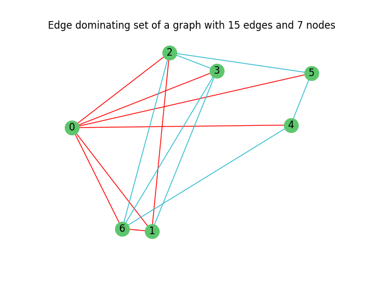

# Projeto Algoritmos Avançados #1

Decision Problem - Edge dominating set of a graph with _k_ edges.



The edge dominating set corresponds to the set defined by the red lines.

## Purpose

Implementing two different approaches to solve the _k_-edge dominating problem, we can infer which is better depending on the specific purpose for the problem, since each approach has its ups and downs, which are explored in more detail on the presented report.

### 1. Exaustive approach: 

Using a brute-force approach, calculate all _k_-edge dominating sets of a graph, by analysing all possible combinations of graph edges.

### 2. Heuristic Implementation:

Using an heuristic, use the most high density nodes and verify whether their appended edges constitute an edge dominating set or not. This is based on the belief that most high density nodes, which have several appended edges, and therefore, are the best candidates to find an edge dominating set.


## How to run tests (Windows):

1. ```python3 -m venv venv```

2. ```.\venv\Scripts\activate```

3. ```pip install -r .\requirements.txt```

4. ```.\ProjetoAA.py```


### Results

Test results are presented in the `./info_nodes` directory.

### Graphics

Generated graphics are presented in the `./images` directory