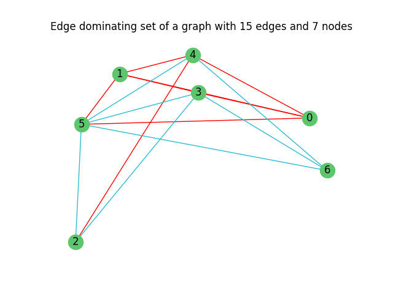

# Projeto Algoritmos Avançados #2

Decision Problem - Edge dominating set of a graph with _k_ edges.



The edge dominating set corresponds to the set defined by the red lines.

## Purpose

Implementing a randomized approach to solve the _k_-edge dominating problem, and infer how it, although using non-deterministic methods, can obtain solid solutions to the problem.

### Randomized approach: 

Different sets of edges are generated randomly, and then verified whether it consists on an edge dominating set or not. This represents a solid solution since it consists on a problem where checking if the candidate solution is indeed a solution for the problem or not is simpler to verify than generating an accurate solution.

## How to run tests (Windows):

1. ```python3 -m venv venv```

2. ```.\venv\Scripts\activate```

3. ```pip install -r .\requirements.txt```

4. ```.\ProjetoAA.py```

### Results

Test results are presented in the `./info_nodes` directory.

### Graphics

Generated graphics are presented in the `./images` directory

### SW grafos

Imported graphs for test usage should be downloaded, unzipped, and placed directly inside this directory (`./Proj2`), in which the folder containing them should be named `sw_grafos`. This is due to the fact that the files are too big for github to handle.

Link to download folders containing the files: [sw_grafos](https://uapt33090-my.sharepoint.com/:f:/g/personal/brunams21_ua_pt/Er6fmJH4AuRAqHpKxHyeiT0BXidgyZJgWyphZJstJexJcg?e=W40rCi)


